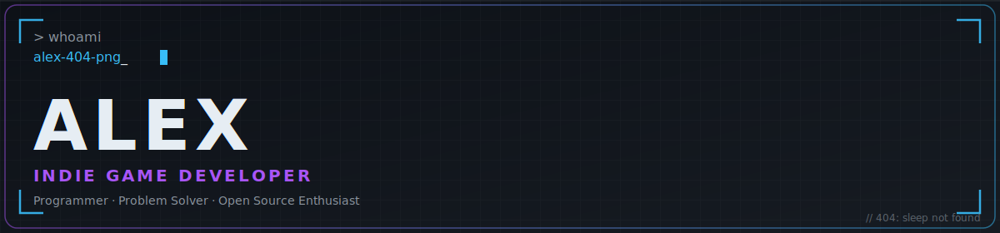

<div align="center">



<a href="https://readme-typing-svg.demolab.com/">
  
</a>

</div>


### `> whoami`

```js
const alex = {
  role: "DEVELPOER",
  basedIn: "somewhere between Debug and Release",
  languages: ["C", "C++", "C#", "Java", "Python", "JavaScript"],
  currentBuild: "v0.1.0-alpha",
  philosophy: "ship broken before never shipped",
  status: () => "compiling ideas into code",
};
```

I build things — mostly games, sometimes tools, occasionally chaos. I like systems that are simple to read and hard to break, and I'd rather understand *why* something works than memorize that it does. Long-term goal: ship a game I'm proud of, then do it again, better.


### 🧭 Developer Philosophy

| | Principle |
|---|---|
| 🎮 | **Players first.** Every system exists to make the moment-to-moment feel good — not to show off the architecture behind it. |
| 🧩 | **Simple beats clever.** Code I can't explain in one sentence is code I'll regret in six months. |
| 🛠 | **Build, break, learn.** Prototypes are disposable. Lessons aren't. |
| 🔁 | **Finish things.** A small finished project teaches more than a huge unfinished one. |


### 🎯 Current Mission

<!-- ✏️ EDIT: swap in your real project name, one-line pitch, and repo link -->
> **`bubbleplaza`** — a one-line pitch for the game I'm currently building.
>
> 
> 
> [`→ follow progress`](#)


### 📦 Featured Projects

<!-- ✏️ EDIT: replace these three cards with your real repos — name, one-line description, tech, and link -->
<table>
<tr>
<td width="33%" valign="top">

**🚀 [NovaCommerce Dashboard](#)**
<br/>A premium frontend dashboard for e-commerce management featuring a responsive layout, interactive UI components, analytics widgets, product management, order tracking, and customer management—all built using HTML.
<br/><br/>


</td>
<td width="33%" valign="top">

**🧪 [chess ai](#)**
<br/>**Chess AI** is a modern chess game built with **Python** and **Pygame**, featuring an intelligent AI opponent powered by the **Minimax algorithm** with **Alpha-Beta Pruning**. Enjoy complete chess rules, multiple AI difficulty levels, move highlighting, and a clean, responsive interface for a strategic single-player experience.
<br/><br/>


</td>
<td width="33%" valign="top">

**🕹️ [Project Three](#)**
<br/>One-line description of what it does and why it's interesting.
<br/><br/>


</td>
</tr>
</table>

<div align="center"><sub>📌 tip: THIS ARE THE TOP PROJECTS <b> VISIT NOW </b> on github.com</sub></div>


### 🛠 Tech Stack

**Languages**
<br/>


**Tools & Workflow**
<br/>


**Game Dev** <!-- ✏️ EDIT: add your real engine(s) — Unity / Unreal / Godot / a custom engine -->
<br/>


### 🧬 Skill Tree




### 📊 Stats Dashboard

<div align="center">


</div>


### 📜 Quest Log

<!-- ✏️ EDIT: keep this list current — check items off as you actually finish them -->
- [x] Get comfortable across C, C++, C#, Java, Python & JavaScript
- [ ] Ship a complete, playable build of `[PROJECT CODENAME]`
- [ ] Open-source a tool other devs actually find useful
- [ ] Write a postmortem on what shipping it taught me
- [ ] Start the next one


### 🎲 Fun Facts

<!-- ✏️ EDIT: swap these for facts that are actually true about you -->
- My commit messages are more honest at 2am than at 2pm.
- I've rewritten the same system three times and liked the third version the least.
- `git blame` has taught me more humility than any code review.
- I debug faster with music; I debug *correctly* in silence.


### 📡 Contact

<!-- ✏️ EDIT: replace these with your real handles/links, or delete the ones you don't use -->
<div align="center">

[](mailto:you@example.com)
[](https://twitter.com/yourhandle)
[](https://yourname.itch.io)
[](https://discord.gg/yourinvite)

</div>



<div align="center">
<sub>thanks for reading all the way to the bottom — that's already further than most tutorials I start</sub>
<br/><br/>
<a href="#"><sub>↑ back to top</sub></a>
</div>
